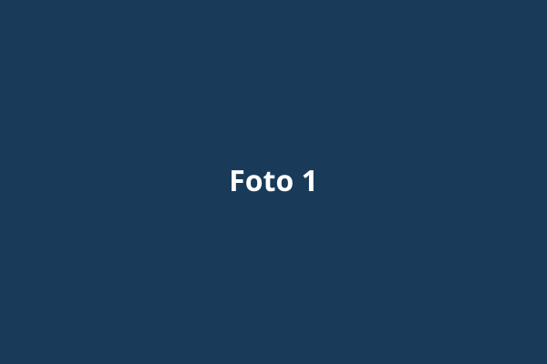
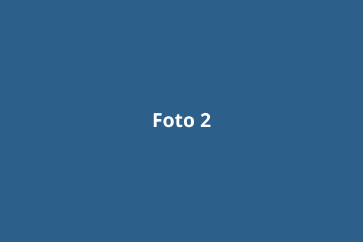

::: ficha-foto
**Lugar:**   
**Fecha:**   
**Equipo:** 
:::

> **Plantilla.** Copia la carpeta `blog/galeria-ejemplo/` con un nombre nuevo, cambia los datos del encabezado (`foto:`) y reemplaza las imágenes por tus fotos. Borra esta carpeta cuando ya no la necesites.

Escribe aquí la historia detrás de la serie.

::: {layout-ncol=2}
{group="galeria"}

{group="galeria"}
:::
