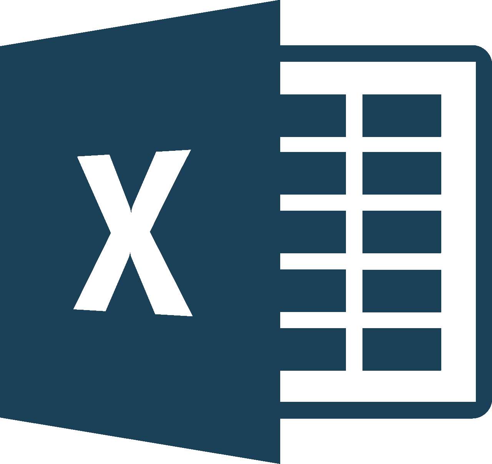
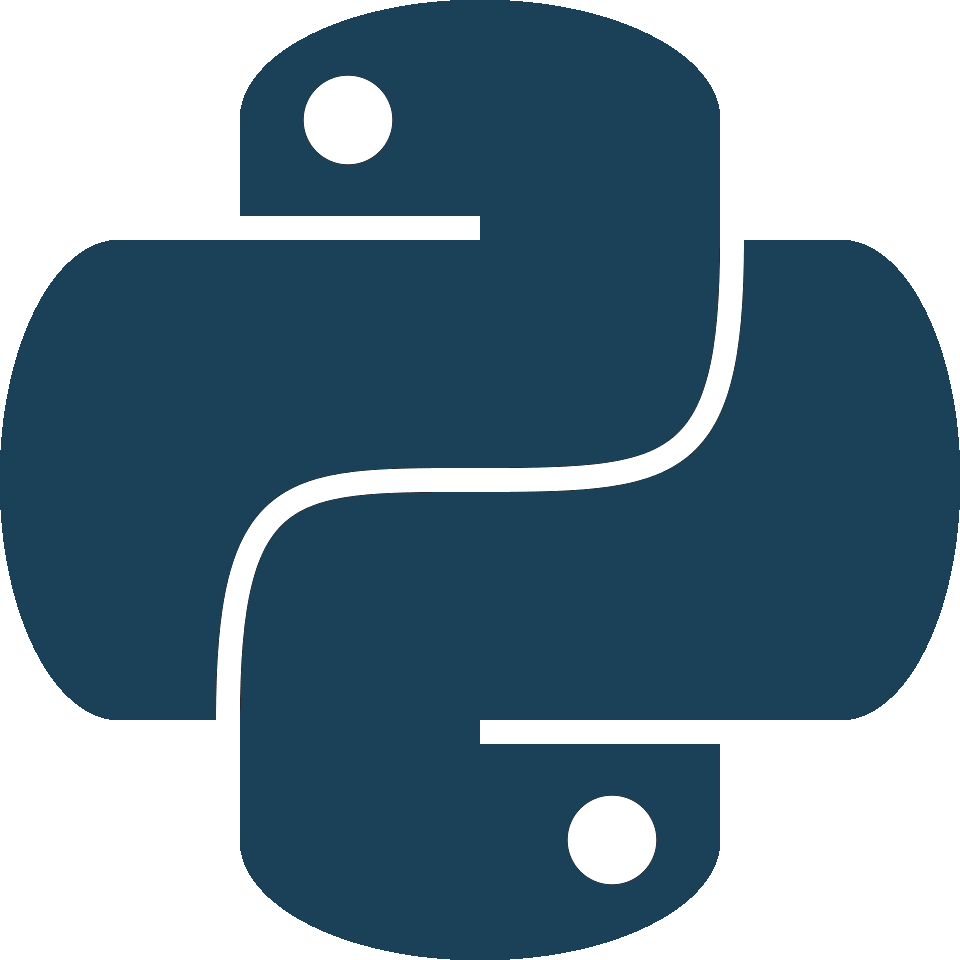
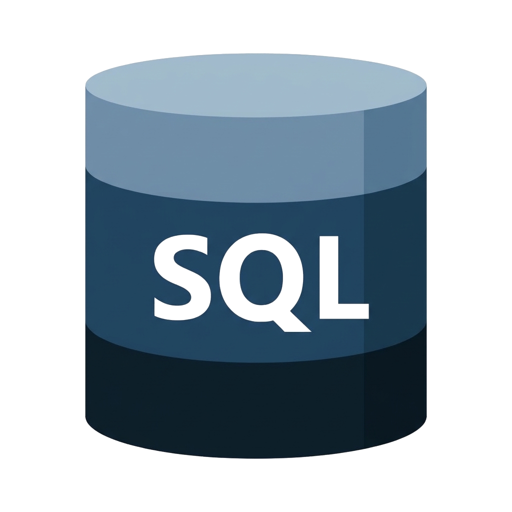
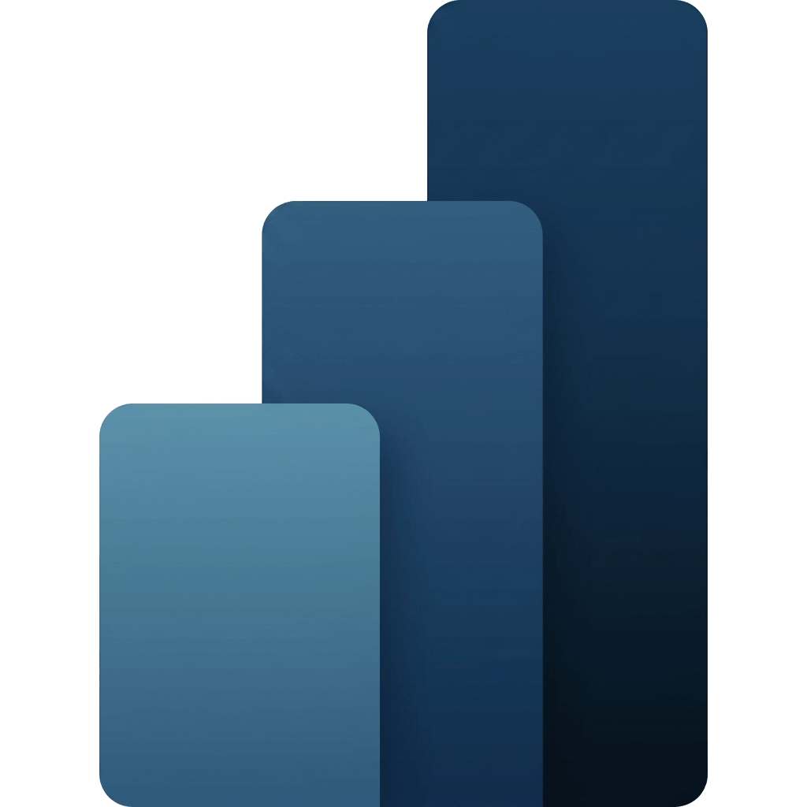
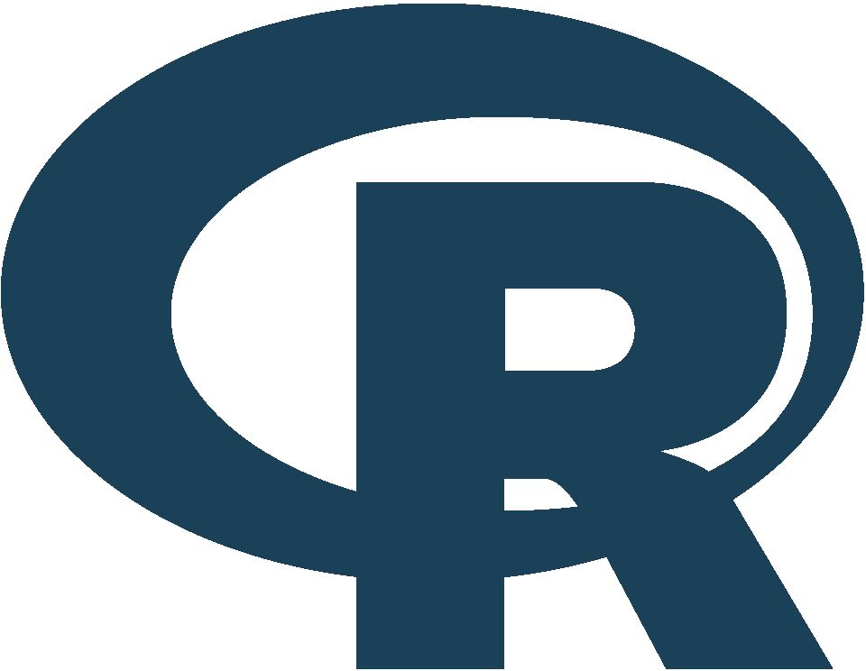

:::: {.hero .column-screen}
::: hero-content
[Magadiel Quilacan]{.hero-title role="heading" aria-level="1"}

[Científico de datos especializado en análisis de industrias]{.hero-usp}

[\[SUBTÍTULO: frase breve de 1 o 2 líneas con tu experiencia y resultados\]]{.hero-subtitle}
:::
::::

:::::: {.presentacion .grid}
:::: {.g-col-12 .g-col-md-4 .presentacion-photo}
{.profile-img fig-alt="Foto de Magadiel Quilacan"}

::: contact-links
[Magadiel.1999\@gmail.com](mailto:magadiel.1999@gmail.com){.contact-email}

[LinkedIn](https://www.linkedin.com/in/magadiel-quilacan){.social-icon .social-linkedin target="_blank"} [GitHub](https://github.com/magadielquilacanyus4-ops){.social-icon .social-github target="_blank"}
:::
::::

::: {.g-col-12 .g-col-md-8 .presentacion-text}
## Presentación

\[SALUDO: un párrafo corto presentándote, ej. "¡Hola! Soy Magadiel, ..."\]

- **\[Perfil o especialidad\]**: \[detalle\]
- **\[Años de experiencia\]** como **\[rol\]**
- Formación en **\[carrera / institución\]**
- Certificaciones: **\[certificación 1\]**, **\[certificación 2\]**
- Resuelvo problemas de **\[tipo de problemas\]**
- Domino **\[herramienta 1\]**, **\[herramienta 2\]** y **\[herramienta 3\]**
:::
::::::

::: tools-section
## Stack Tecnológico

```{=html}
<!--
  Logos: agrega un archivo por herramienta en images/carrusel_stack_tecnologico/ (SVG o PNG transparente).
  Para activar cada logo, añade un  antes del <span class="tool-name">,
  en ambos grupos (el segundo grupo es un duplicado necesario para el bucle infinito).
  El alt va vacío porque el nombre ya aparece como texto en la tarjeta.
-->
<div class="tools-carousel" aria-label="Herramientas de trabajo">
  <div class="tools-track">
    <ul class="tools-group">
      <li class="tool-card"><span class="tool-name">Excel</span></li>
      <li class="tool-card"><span class="tool-name">Sheets</span></li>
      <li class="tool-card"><span class="tool-name">Python</span></li>
      <li class="tool-card"><span class="tool-name">SQL</span></li>
      <li class="tool-card"><span class="tool-name">Power BI</span></li>
      <li class="tool-card"><span class="tool-name">Tableau</span></li>
      <li class="tool-card"><span class="tool-name">R</span></li>
      <li class="tool-card"><span class="tool-name">GitHub</span></li>
    </ul>
    <ul class="tools-group" aria-hidden="true">
      <li class="tool-card"><span class="tool-name">Excel</span></li>
      <li class="tool-card"><span class="tool-name">Sheets</span></li>
      <li class="tool-card"><span class="tool-name">Python</span></li>
      <li class="tool-card"><span class="tool-name">SQL</span></li>
      <li class="tool-card"><span class="tool-name">Power BI</span></li>
      <li class="tool-card"><span class="tool-name">Tableau</span></li>
      <li class="tool-card"><span class="tool-name">R</span></li>
      <li class="tool-card"><span class="tool-name">GitHub</span></li>
    </ul>
  </div>
</div>
```
:::

::::: projects-section
## Proyectos

::: {#home-projects}
:::

::: projects-more
[Ver todos los proyectos](projects/index.qmd){.btn .btn-primary .projects-btn}
:::
:::::
